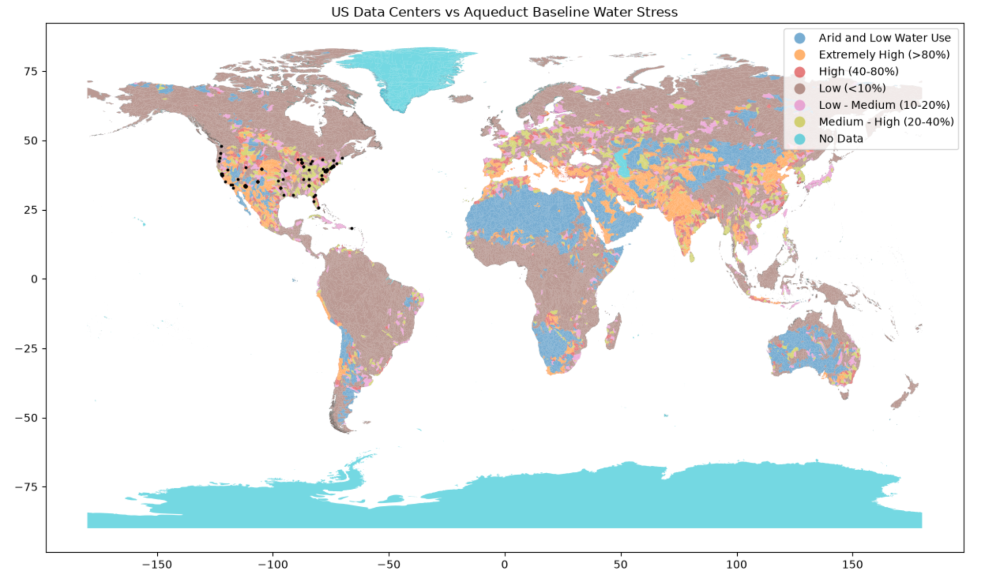

# Carbon and Code: Environmental and Social Impacts of Data Centers

*Evaluating data center siting in South Dakota through spatial analysis of water risk, community infrastructure, and centralized versus distributed alternatives.*


> **Project scope:** This hackathon prototype supports preliminary siting discussions. It is not a regulatory zoning determination, engineering assessment, or proof of environmental harm. Completed work described below reflects the team's project account; site-specific claims require traceable supporting records.

## People and Roles { #people }

| Name | Affiliation | Starting Role |
|---|---|---|
| Cully Pourier | Hackathon Participant | Project framing, visual documentation, repository curation |
| Leon Red Kettle | Hackathon Participant | Spatial analysis, zoning criteria, architectural modeling |
| Emmanuel Akwasi Opoku | Hackathon Participant | Technical pipeline, data synthesis, narrative integration |
| Brittany Mark | Hackathon Participant | Data engineering, pipeline streaming, source verification |

## Team Norms and Decision Making { #team-norms-and-decision-making }

Our team norms:

- Prioritize community impact and environmental protection over technical complexity.
- Document assumptions, data limitations, and alternative interpretations.
- Ensure every team member contributes to technical artifacts and communication.
- Respect Tribal sovereignty and restrictions on sharing sensitive information.

**Decision rule:** Seek consensus first. If time is limited, the member leading the relevant technical module decides how to proceed while documenting trade-offs and unresolved concerns.

## Our Question { #project-question .oasis-report-out-section }

> How can South Dakota use spatial environmental and infrastructure data to screen proposed data center locations for water-related and community concerns, and compare centralized and distributed development without assuming either is inherently preferable?

### Hackathon Success Criteria

- Extract and spatially filter relevant data center records for South Dakota.
- Develop a prototype Red–Yellow–Green screening framework.
- Visualize facility locations alongside water-risk indicators, public infrastructure, and precautionary buffers.
- Compare centralized and distributed scenarios using equal aggregate capacity.
- Clearly communicate uncertainty and the need for local review.

## Why This Matters { #why-this-matters .oasis-report-out-section }

Data center siting raises questions about electricity demand, cooling water, infrastructure costs, noise, land use, and how benefits and burdens are distributed.

Our project focuses on identifying these questions early enough to inform planning.

- **Electricity:** Proposed capacity should be evaluated alongside expected operating loads and utility infrastructure.
- **Water:** Cooling design, water source, seasonal availability, and existing demands are necessary inputs to a site-specific assessment.
- **Community infrastructure:** Nearby schools and other sensitive locations warrant investigation, but distance alone does not establish exposure or harm.
- **Local decision-making:** Spatial screening should support—not replace—community knowledge, appropriate governance, and technical review.

The original draft included numerical claims about statewide capacity, daily water use, and noise levels. These are not treated as established findings here because their underlying records, measurement conditions, and citations were not supplied.

### Potential Audiences

- Tribal land-use planners and designated representatives
- Municipal and county planning boards
- Residents and environmental justice organizations
- Water utilities and electric cooperatives
- Infrastructure planners and researchers

These are potential audiences, not claims of consultation or endorsement.

## What We Tried to Build { #what-we-tried-to-build .oasis-report-out-section }

Our intended product is a reproducible spatial screening pipeline that compares proposed data center coordinates with environmental and community-infrastructure layers.

The team's reported work includes:

- Filtering data center records for South Dakota
- Creating precautionary buffers around selected features
- Exploring overlap between facility locations and screening areas
- Preparing a prototype map and reusable geographic outputs

**Chosen pathway:** Data Investigator and Technical Extender.

The purpose is to identify locations requiring further investigation—not to determine legal compliance or automatically approve or exclude development.

### Water-Stress Comparison Visual



*Team-provided visual. Interpret using the map legend and source metadata. Spatial overlap with water stress does not establish facility water consumption or causation.*

## Data and Evidence { #data-and-evidence }

| Dataset or Layer | Source Identified by the Team | Intended Use | Verification Needed |
|---|---|---|---|
| Data center locations and available footprints | IM3 / PNNL | Locate facilities and examine spatial patterns | Exact release, field definitions, coverage, and facility status |
| Future facility projections | IM3 projection products | Explore modeled development scenarios | Distinguish modeled locations from announced or permitted projects |
| Baseline water stress | WRI Aqueduct | Provide regional water-risk context | Version, indicator, reference period, and spatial resolution |
| Municipal water service areas | IM3-linked or relevant utility/state sources | Identify service-area context | Exact producer, date, and boundaries |
| Electric transmission lines | EIA / HIFLD sources identified in the draft | Examine infrastructure corridors | Exact dataset and attributes; voltage does not establish spare capacity |
| Broadband or fiber-related coverage | FCC / IM3 sources identified in the draft | Explore connectivity context | Distinguish service availability from physical fiber routes |
| Public schools | NCES / HIFLD sources identified in the draft | Locate schools for precautionary screening | Dataset vintage and positional accuracy |
| Named development records | CleanView and primary project records | Check proposed capacity and project status | Direct record links, dates, and confirmation from primary documentation |

### Evidence Boundaries

- Water service areas are not watersheds and do not measure depletion.
- Broadband availability is not necessarily a map of fiber trunk lines.
- Modeled future facilities are not confirmed development proposals.
- Building footprints do not directly measure IT floor area or electricity demand.
- Proximity does not establish noise exposure, air-quality effects, or health outcomes.

Record source URLs, versions, access dates, licenses, units, and processing steps before presenting quantitative findings.

## Estimated Power Demand by Facility Size { #power-demand .oasis-report-out-section }

The following table preserves the values supplied by the team as a preliminary size-to-power reference.

**These ranges and voltage mappings are unverified illustrative values, not universal engineering standards.**

| Building Area (sq. ft.) | Illustrative Power Range (MW) | Supplied Voltage (kV; Unverified) |
|---:|---:|---:|
| 50,000 | 5–10 | 35 |
| 100,000 | 10–20 | 69 |
| 250,000 | 25–75 | 69–138 |
| 500,000 | 50–150 | 138 |
| 1,000,000 | 100–300 | 138–230 |

*Source: Team-supplied reference screenshot. Original technical source and publication date remain to be confirmed.*

### Important Notes

- **MW** measures electrical power.
- **MWh and GWh** measure energy consumed over time.
- **kV** measures voltage, not power consumption.
- The source does not specify whether MW represents IT load, total facility load, or contracted capacity.
- The source does not define whether area represents footprint, total floor area, or IT equipment space.
- The first two rows imply 100–200 W per square foot; the remaining rows imply 100–300 W per square foot.
- Voltage requirements must be confirmed with the utility, not inferred from building size alone.
- These rows should not be extrapolated to the 2 MW and 500 MW scenarios without a justified method.

### Calculation Framework

```text
Estimated power (MW)
= applicable area (sq. ft.) × power density (W/sq. ft.) ÷ 1,000,000

Average facility power (MW)
= facility capacity (MW) × assumed average load fraction

Annual energy (MWh)
= average facility power (MW) × hours in the year
```

For example, a facility averaging 10 MW over a 365-day year would consume:

```text
10 × 8,760 = 87,600 MWh = 87.6 GWh
```

This is illustrative arithmetic, not measured consumption.

## Centralized Versus Distributed Scenarios { #development-scenarios .oasis-report-out-section }

A fair electrical-capacity comparison requires **one 500 MW facility versus 250 facilities of 2 MW each**.

For this example, MW represents total facility electrical capacity.

| Comparison Item | Centralized | Distributed |
|---|---:|---:|
| Number of facilities | 1 | 250 |
| Capacity per facility | 500 MW | 2 MW |
| Aggregate capacity | 500 MW | 500 MW |
| Assumed average load fraction | 80% | 80% |
| Aggregate average power | 400 MW | 400 MW |
| Annual energy at 8,760 hours | 3,504,000 MWh | 3,504,000 MWh |
| Annual energy in GWh | 3,504 GWh | 3,504 GWh |

*The 80% load fraction is an assumption, not an observed operating value.*

### Interpretation

With equal aggregate capacity and equal average load fractions, both scenarios have the same modeled electricity consumption.

Distribution changes where demand occurs. It does not automatically reduce total water use, energy consumption, or environmental impact.

Equal electrical capacity also does not guarantee equal computing output. Comparisons should consider equipment, workloads, cooling, and operating conditions.

**Named-project caution:** The draft identified Gemini and Sequitor Edge as examples. Their capacities, locations, and status require direct supporting records. The calculations above do not verify those projects.

## Methods and Tools { #methods-and-tools }

The following summarizes the team's reported approach and the limits that should accompany its results.

| Approach | Team-Reported Work | Interpretation Boundary |
|---|---|---|
| Spatial extraction | Filtered data center layers to South Dakota | Verify release, facility status, and duplicate records |
| Buffer calculation | Applied a 2-mile precautionary buffer around selected schools and water service areas | A team-selected screening assumption, not a verified legal or health threshold |
| Spatial overlay | Examined overlap with selected infrastructure and environmental layers | Overlap flags questions; it does not establish harm or noncompliance |
| Scenario comparison | Compared large centralized and smaller distributed configurations | Match aggregate capacity and document load and cooling assumptions |

### Prototype Traffic-Light Framework

| Category | Screening Meaning | Appropriate Next Step |
|---|---|---|
| Red | Overlap with a team-defined high-concern screening feature | Flag for detailed review; do not describe as a legal exclusion unless verified |
| Yellow | Precautionary proximity or unresolved constraints | Collect additional site-specific evidence |
| Green | No selected screening flag detected in available data | Continue review; not proof of suitability, safety, or approval |
| Unclassified | Required data are missing or insufficient | Obtain evidence before assigning a category |

**Missing information must not default to Green.**

### Technical Checks

- Use a suitable projected coordinate system for distance buffers.
- Convert the 2-mile assumption consistently: **3,218.688 meters**.
- Validate geometries before intersections or spatial joins.
- Preserve source identifiers and missing-data flags.
- Keep administrative, watershed, service-area, and jurisdictional boundaries distinct.
- Test how results change with different buffer distances.

### Working Visual


*Team-provided working figure. Confirm its layer names, dates, legend, and projection scenario before using it to support a specific claim.*

### Obstacles Encountered

- National layers required regional cropping to reduce processing time.
- Site-specific cooling and water-use information was difficult to obtain.
- Real-time local water drawdown information was not available within the hackathon workflow.

Generic water-use ranges should not replace site-specific evidence without a clearly stated model and suitable source.

## What We Made { #what-we-made }

The team reports producing:

- **Main artifact:** A prototype “Smart Zoning Engine” for exploratory spatial screening.
- **Code:** Jupyter notebooks using GeoPandas spatial joins and buffers.
- **Reusable output:** A South Dakota GeoJSON subset.
- **Communication artifact:** A comparison of power-demand assumptions and development scenarios.

[Open the team code folder](https://github.com/CU-ESIIL/hackathon_group_OASIS/tree/main/code)

Specific notebook and output filenames should be linked when confirmed.

## What We Learned { #what-we-learned .oasis-report-out-section }

**Observation:** The team encountered records describing existing facilities and potential future developments with different capacity scales.

**Evidence boundary:** Statewide totals and named-project capacities require dated, directly traceable records. Proposed capacity is not current electricity consumption, and modeled locations are not confirmed projects.

**Interpretation:** Early spatial screening can organize questions about infrastructure and community context. It cannot independently determine whether a development is acceptable or whether distributed facilities are preferable.

### Claim Ladder

| Level | Team Statement |
|---|---|
| What We Observed | Spatial layers can be combined to identify overlap with selected screening features. |
| What We Calculated | An equal-capacity comparison of 500 MW and 2 MW facilities requires 250 smaller facilities. |
| What We Think | Early screening may help identify questions for local planning and technical review. |
| What We Do Not Know | Site-specific cooling, actual operating loads, water availability, and exposure conditions. |
| What We Should Not Claim | That buffers prove harm, Green means approved, or distributed development necessarily reduces total environmental impacts. |

## Project Limitations and Data Challenges { #project-limitations .oasis-report-out-section }

**Contributor:** Leon Red Kettle

- **Time constraints:** The limited analysis timeframe narrowed our scope to the most accessible datasets relevant to the project.
- **Data availability:** Historical 30-day changes were not consistently available across facilities, limiting comparisons over time.
- **Incomplete data and attributes:** Some initial CSV files were empty or lacked required columns, including stage-based power changes. We pivoted to alternative sources, including the Compute Atlas JSON.
- **Interpretation limits:** Missing values should not be treated as zero or as evidence of no change. Comparisons across sources require consistent definitions, reporting dates, and facility coverage.

## What Did Not Work { #what-didnt-work }

The team could not incorporate dynamic local water drawdown information within the hackathon timeframe.

Municipal service boundaries were used as a contextual layer, but they are **not a substitute for hydrological measurements or a validated vulnerability model**.

A future version should distinguish:

- Service coverage
- Source-water catchments
- Groundwater conditions
- Seasonal water availability
- Existing demand and permitted withdrawals

## What Remains Uncertain { #what-remains-uncertain .oasis-report-out-section }


### Major Unknowns

- Actual and expected average electrical loads
- Cooling technologies and operating conditions
- Water sources, withdrawals, and consumption
- Utility agreements and infrastructure upgrade requirements
- Backup generation, fuels, and emissions controls
- Site-specific noise levels at nearby receptors
- Completeness and currency of the spatial datasets

### What Would Strengthen the Work?

- Primary project and utility documentation
- Measured acoustic baselines and site-specific modeling
- Water allocation and seasonal availability information
- Reproducible notebooks with exact data versions
- Sensitivity tests for buffer distances and load assumptions
- Appropriate community and technical review

## What Is Next { #whats-next .oasis-report-out-section }

### Technical Next Steps

1. Validate source versions and named-project records.
2. Publish reproducible notebooks and link exact outputs.
3. Add configurable load assumptions and buffer distances.
4. Separate electricity, water, and community-screening results.
5. Add water modeling only when cooling, source-water, and hydrological inputs are sufficient.

A facility-wattage slider alone cannot calculate watershed drawdown.

### Stewardship Next Steps

Seek guidance from relevant community representatives, regional planners, municipal boards, and Tribal authorities on the question, criteria, and public outputs.

Participation should shape the analysis—not simply endorse a completed model.

### Questions for Developers

- What are expected average and peak loads?
- Which cooling system and water sources are proposed?
- What are expected withdrawals and consumption during normal and drought conditions?
- What infrastructure upgrades are needed, and who pays?
- What noise and emissions evidence will be made available?
- How will performance commitments be monitored?
- How will affected communities participate?

## Who Should Be Involved Next { #who-should-be-involved-next }

Potential roles and perspectives—not claims of consultation or approval:

- Tribal historic preservation and water resource departments
- Community members and designated representatives
- School administrators and environmental health researchers
- Rural electric cooperatives
- Municipal water utility engineers
- Local planners and independent technical reviewers

Their guidance should help establish appropriate screening criteria, evidence needs, information-sharing boundaries, and interpretation.

## Code, Data, Citation, and Reuse { #code-data-citation-and-reuse }

### Sources

- [IM3 Open Source Data Center Atlas](https://immm-sfa.github.io/datacenter-atlas/)
- [WRI Aqueduct](https://www.wri.org/aqueduct)
- [Team repository](https://github.com/CU-ESIIL/hackathon_group_OASIS)
- [OLC Climate Resiliency and Digital Sovereignty Learning Lab](https://github.com/olc-techsupport/Education-Climate-Resiliency-Digital-Sovereignty)

The draft also identified CleanView, USGS, EIA, HIFLD, FCC, and NCES. Add direct links to the exact records and dataset releases used before treating related numerical claims as verified.

**Power-table attribution:** Team-supplied screenshot; original technical source unresolved.

Preserve the upstream OASIS template attribution and applicable licenses.

### Reproduction and Public-Sharing Checklist

- [ ] Record exact dataset versions and access dates.
- [ ] Document units, coordinate systems, and preprocessing.
- [ ] Link the notebooks and generated outputs.
- [ ] Distinguish measured, reported, assumed, and projected values.
- [ ] Document missing data and sensitivity tests.
- [ ] Verify image filenames and capitalization.
- [ ] Preserve licenses and attribution.
- [ ] Remove sensitive or unauthorized information.
- [ ] Do not imply community approval or regulatory compliance.

---

*Carbon and Code is a hackathon research prototype. Its outputs support preliminary discussion and further investigation, not automatic siting decisions.*
